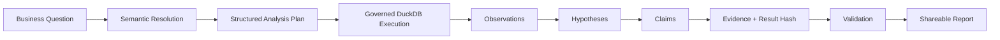
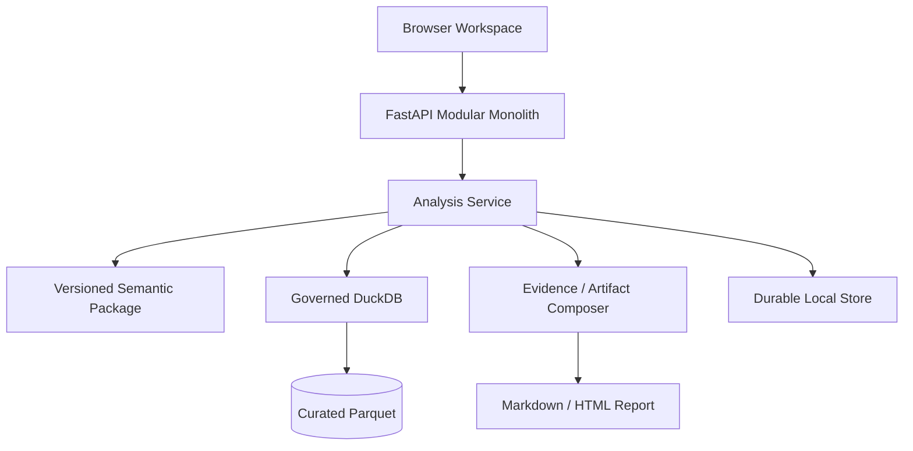

<div align="center">

# Enterprise Intelligence Workspace

### Evidence-Grounded Enterprise Data Agent

**Turn a business question into a structured investigation, governed data execution, traceable evidence, and a shareable report.**

`FastAPI` · `DuckDB` · `Parquet` · `Semantic Layer` · `Evidence Lineage` · `Validation`

[Full Technical README](../README.md) · [Architecture](../docs/architecture-development-baseline.md) · [Core Design](../docs/core-module-design.md) · [Product Gap Analysis](../docs/FULL_PRODUCT_GAP_ANALYSIS.md)

</div>

---

## Why this project matters

Most “data agents” stop at **natural language → SQL → answer**. This project treats enterprise analysis as a governed investigation where important findings must remain connected to the **dataset snapshot, semantic definition, computation, evidence, and validation state** that produced them.

The current reference domain is Iowa Class E wholesale order intelligence, but the architecture separates domain semantics from the investigation and execution contracts.

## Investigation Flow



## Evidence — what is actually implemented

| Capability | Current implementation |
|---|---|
| Natural-language analysis resolution | metric and period resolution with explicit unsupported-question handling |
| Semantic governance | versioned semantic packages and structured analysis plans |
| Data execution | read-only DuckDB over curated immutable Parquet |
| Analysis | trend, comparison, contribution and mix-sensitive analysis |
| Investigation state | hypotheses, observations, claims, evidence and validation |
| Traceability | result hash, dataset snapshot, semantic version and context version |
| Workspace product | history, follow-up lineage, semantic explorer, quality dashboard and reports |
| Evaluation scaffold | 12 Golden Cases are loaded for deterministic evaluation |

### Trust boundary

The project **does not invent evaluation scores**. The Golden Case suite is reported as loaded but not run until a deterministic scorer produces measured results. Enterprise-scale IAM, richer checkpoint/replay and complete provider adapters remain follow-on work.

## Architecture



## Data Contract

The frozen reference snapshot is `iowa_liquor_snapshot_2026_07_v1`, covering **2024-01-01 through 2026-07-31**. The data represents Iowa Class E wholesale order activity — not consumer POS sales, store profit or net profit. Cost and spread metrics are only treated as valid from **2025-07-01** onward.

This distinction is part of the system design: the agent is expected to clarify or refuse unsupported analytical claims rather than silently extrapolate beyond the data contract.

## Quick Start

Requirements: **Python 3.12+**.

```bash
git clone https://github.com/Benjamindaoson/enterprise-data-agent.git
cd enterprise-data-agent
make setup
make data
make dev
```

Then open `http://127.0.0.1:8000`.

Quality commands:

```bash
make test
make lint
make evaluation
```

For implementation details, dataset governance, current limitations and the complete design history, continue to the **[full README](../README.md)**.

---

<div align="center">

**Business question → governed computation → evidence → validated claim**

</div>
