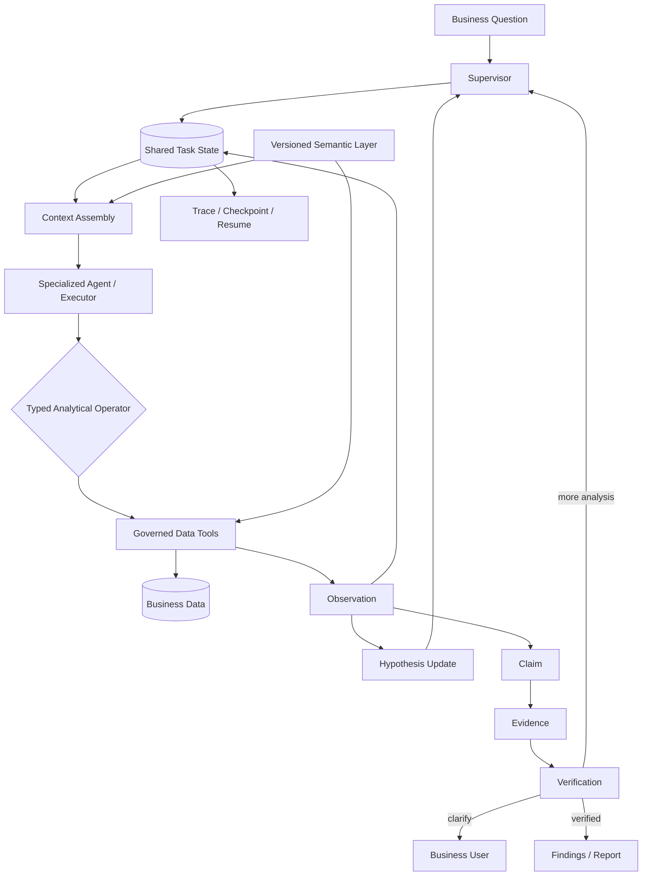

<div align="center">

# Enterprise Data Agent

### 企业自主数据分析智能体平台

**Autonomous multi-agent analytics for long-horizon business investigation.**

`Agent Systems` · `Multi-Agent Orchestration` · `Context Engineering` · `Semantic Layer` · `Agent Runtime`

[Full Technical README](../README.md) · [Architecture](../docs/architecture-development-baseline.md) · [Core Design](../docs/core-module-design.md) · [Progress](../docs/FULL_PRODUCT_PROGRESS.md)

</div>

---

## What this project is

Enterprise Data Agent is an autonomous analytics system for multi-store business operations. It is designed for questions that cannot be answered by a single SQL query: product, category, store, supplier, trend, anomaly, contribution, and root-cause analysis.

A business question becomes a durable analysis task. The system resolves business semantics, plans the investigation, chooses the next analytical action, executes governed data tools, updates hypotheses from observations, verifies claims against evidence, and decides whether to drill down, replan, clarify, or finish.

```text
Business Question
      ↓
Resolve Business Semantics
      ↓
Plan Investigation
      ↓
Choose Analytical Action
      ↓
Execute Governed Data Tool
      ↓
Observation → Hypothesis Update
      ↓
Claim → Evidence → Verification
      ↓
Replan / Drill Down / Clarify / Finish
```

> **The model decides what to analyze next; deterministic tools decide how the data is executed.**

---

## Core engineering problems

### 1. Controlled multi-agent coordination

Long-running multi-agent analysis can fail through repeated work, context drift, and conflicting state. The system uses a **Supervisor–Executor architecture + shared task state + structured handoffs**.

- the **Supervisor** owns task decomposition, routing, replanning, and stop decisions;
- specialized Agents operate inside explicit responsibility boundaries;
- Agents coordinate through shared state rather than free-form conversation;
- observations, evidence, and execution status are written back to the task state before the next decision.

```text
Business Question
       ↓
   Supervisor
       ↓
 Shared Task State
       ↓
Specialized Executors
       ↓
Observation / Evidence / Status
       ↓
 Supervisor replans
```

### 2. Long-horizon execution and context engineering

Long analysis chains accumulate plans, tool outputs, intermediate findings, failed attempts, and verification records. Replaying the full trajectory into every model call increases cost and degrades context quality.

The runtime separates **durable task state** from **model context**:

- task plans, Agent actions, tool results, observations, claims, and validation results live outside the prompt;
- **Checkpoint / Resume + Failure Recovery** preserve execution progress;
- context is compressed and assembled dynamically for the current Agent and subtask;
- retry, timeout, replay, and recovery are runtime concerns rather than prompt behavior.

### 3. Versioned Semantic Layer

Business meaning changes across regions, categories, and business units. The same term may map to different formulas, time rules, filters, dimensions, or business rules.

Enterprise Data Agent separates these definitions from the Agent Core through a versioned **Semantic Layer** that can provide:

- metrics and calculation rules;
- dimensions and allowed relationships;
- time semantics and availability windows;
- business and quality rules;
- supported analytical capabilities and access policies.

The same Agent Runtime can therefore adapt to different regions, categories, and business units through configuration rather than rewriting the core Agent workflow.

### 4. Autonomous analysis with evidence-backed verification

The Agent is not asked to freely invent arbitrary SQL as its primary reasoning interface. Analysis is expressed through **typed analytical operators** such as:

`Compare` · `Trend` · `Breakdown` · `Contribution` · `Drill-down` · `Anomaly Investigation`

The Agent chooses the next analytical action from the current **Observation + Hypothesis + Task State**. A deterministic data layer executes the bounded operation and returns a structured result.

```text
Observation + Hypothesis
          ↓
Choose Next Analysis
          ↓
Typed Analytical Operator
          ↓
Deterministic Data Tool
          ↓
Structured Observation
          ↓
Update State / Replan / Finish
```

A correct query still does not guarantee a correct business conclusion. Important findings therefore follow a verification chain:

```text
Claim → Evidence → Verification
```

Claims can be linked back to query results, intermediate computations, metric definitions, dataset version, and validation state. Verification writes back into task state and can trigger further drill-down or replanning before a conclusion reaches the final report.

---

## Why this is not another NL2SQL demo

| | Typical NL2SQL / ChatBI | Enterprise Data Agent |
|---|---|---|
| Unit of work | One query | Durable analysis task |
| Reasoning | Generate SQL and summarize | Plan, observe, replan, verify |
| State | Prompt / chat history | Persistent task state |
| Business semantics | Schema hints | Versioned Semantic Layer |
| Data execution | Free-form query generation | Typed analytical operators + governed tools |
| Multi-agent coordination | Free-form conversation | Supervisor + structured handoff + shared state |
| Verification | Usually implicit | Claim → Evidence → Verification |
| Failure handling | Restart / retry | Trace, checkpoint, resume, recovery |

---

## System architecture



---

## Public reference implementation

This repository is the publishable reconstruction of the architecture above. Proprietary business data, internal rules, and private integrations are replaced with reproducible public data and controlled fixtures.

The current public reference uses **6,484,227 curated wholesale-order fact rows** covering **2024-01-01 through 2026-07-31**. It exercises the same core contracts around semantic resolution, task state, analytical operators, evidence, validation, tracing, and reporting without exposing private business information.

Current public implementation includes:

- versioned semantic packages;
- durable task and domain contracts;
- plans, hypotheses, observations, claims, evidence, and validation models;
- aggregate, trend, comparison, contribution, and PVM-style analytical paths;
- governed analytical execution;
- checkpoint artifacts, trace events, task events, and replay surfaces;
- investigation workspace, evidence inspection, task history, and Markdown / HTML reports;
- reproducible data curation and validation commands.

The public code intentionally does **not** claim to reproduce every proprietary production integration. See the [full technical README](../README.md) and [progress report](../docs/FULL_PRODUCT_PROGRESS.md) for implementation boundaries.

---

## Quick start

Requirements: **Python 3.12+**

```bash
git clone https://github.com/Benjamindaoson/enterprise-data-agent.git
cd enterprise-data-agent
make setup
make data
make dev
```

Open `http://127.0.0.1:8000`.

Run checks:

```bash
make test
make lint
make evaluation
```

---

<div align="center">

**Stateful · Semantically grounded · Recoverable · Verifiable**

</div>
