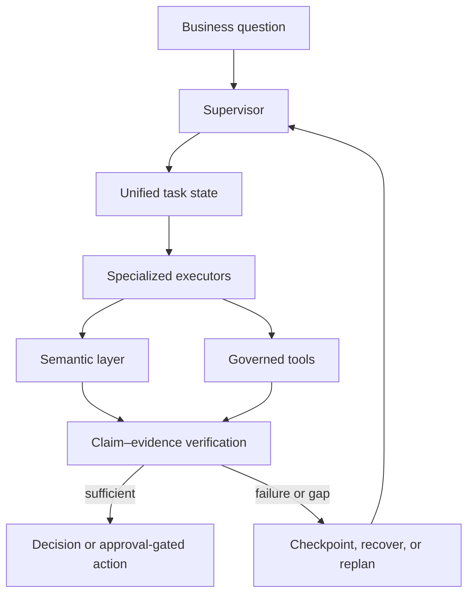

# Architecture

Enterprise Data Agent is a governed long-horizon business-analysis system. The language model selects the next analytical step; deterministic services enforce data, permission, SQL, and action boundaries.

## Core boundaries

- **Supervisor / executor separation:** planning and specialized execution use structured handoffs.
- **Unified state:** checkpoints, evidence, tool outcomes, failures, and approvals remain explicit.
- **Semantic layer:** metrics, dimensions, templates, availability, and permissions constrain analysis.
- **Governed tools:** SQL and business actions execute through deterministic policies rather than unrestricted model code.
- **Verification:** conclusions must bind claims to retrieved or computed evidence.
- **Recovery:** retry, replan, fallback, resume, and human approval are state transitions, not hidden prompt behavior.

## Evidence boundary

Implemented behavior is documented in the repository tests, evaluation baselines, and changelog. Roadmap items are not release claims.
