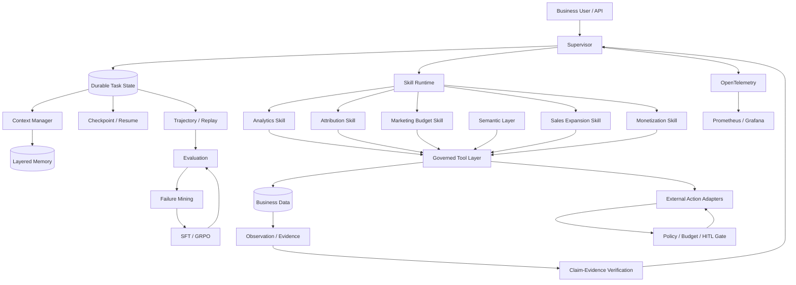

<div align="center">

# Enterprise Business Intelligence & Autonomous Operations Agent

**企业级商业智能与自主经营智能体**

A governed long-horizon Agent system for **business analysis, marketing budget planning, sales expansion, and monetization** — with durable state, reusable skills, evidence verification, safety controls, evaluation, post-training, and production runtime.

`Agent Harness` · `Business Intelligence` · `Autonomous Operations` · `Skill Runtime` · `Long-Term Memory` · `Multi-Agent` · `Semantic Layer` · `SFT` · `GRPO / AgentRL` · `OpenTelemetry`

</div>

---

## What this project is

Most data agents stop at:

```text
Question → SQL → Answer
```

This project targets a harder problem:

```text
Business Question
      ↓
Understand Business Semantics
      ↓
Plan Investigation
      ↓
Acquire Evidence
      ↓
Analyze / Attribute / Verify
      ↓
Make a Business Decision
      ↓
Propose or Execute an Action
      ↓
Observe Outcome
      ↓
Evaluate / Learn / Improve
```

The system is designed around one principle:

> **The model decides what to do next; governed deterministic services decide how data and actions are executed.**

The result is not a single-call NL2SQL demo, but a **stateful, recoverable, auditable business Agent runtime**.

---

## Verified results

### Engineering

| Area | Verified status |
| --- | ---: |
| Core CI | **536 passed / 2 skipped** |
| Post-training tests | **7 passed** |
| PostgreSQL + Redis integration | **6 passed** |
| Hard benchmark acceptance gate | **PASS** |
| UCI real-data benchmark | **587,120 rows parsed in CI** |

The real-data benchmark currently parses:

- **45,211** UCI Bank Marketing rows;
- **541,909** UCI Online Retail rows;
- the existing pinned Iowa wholesale analytical snapshot with **6,484,227** curated fact rows.

### BusinessAgentBench-Hard-v1

Held-out evaluation on 12 long-horizon cases:

| Policy | Success | Avg. reward | Invalid action | Policy violation |
| --- | ---: | ---: | ---: | ---: |
| Direct | 0.00% | -3.7627 | 90.63% | 75.00% |
| Random | 0.00% | -3.8506 | 72.00% | 91.67% |
| Prompt heuristic | 58.33% | 0.0115 | 19.54% | 0.00% |
| **SFT** | **66.67%** | 0.5926 | 11.63% | 8.33% |
| **SFT + GRPO** | **66.67%** | **0.6395** | **10.59%** | 8.33% |

The current result is intentionally reported as:

> **SFT improves task success over the prompt baseline; GRPO further improves reward and action validity, but does not improve task success on this run.**

The CI acceptance gate enforces this result class instead of allowing a training change to silently regress reliability.

---

## Business scenarios

The same runtime supports four business-operation families.

### 1. Business Intelligence

Typical tasks:

- self-service data analysis;
- multi-dimensional drill-down;
- contribution analysis;
- Price / Volume / Mix decomposition;
- anomaly investigation;
- evidence-backed attribution;
- business reporting and visualization.

Example:

> Why did a region's sales decline, which segments contributed most, and what evidence supports the conclusion?

### 2. Marketing Budget

Typical tasks:

- historical campaign performance analysis;
- channel / segment comparison;
- constrained budget allocation;
- scenario simulation;
- ROI-oriented recommendations;
- approval-gated campaign actions.

Example:

> How should the remaining marketing budget be allocated across eligible segments under a fixed budget and risk limit?

### 3. Sales Expansion

Typical tasks:

- merchant / account segmentation;
- opportunity ranking;
- capacity-constrained lead prioritization;
- evidence-backed CRM handoff.

Example:

> Which merchants should the sales team prioritize when only a limited number of accounts can be contacted?

### 4. Monetization

Typical tasks:

- opportunity discovery;
- product / offer matching;
- customer-value analysis;
- revenue simulation;
- retention and cancellation-risk-aware recommendations.

---

## System architecture



---

## Core capabilities

### Agent Runtime / Harness

The runtime treats long-running work as a durable task rather than a chat transcript.

Implemented capabilities include:

- Supervisor–Executor orchestration;
- structured handoff;
- persistent Task State;
- `Plan → Act → Observe → Verify → Replan`;
- checkpoint / resume;
- failure recovery;
- trajectory replay;
- context compression;
- role- and task-scoped context assembly;
- tool-call and token budgets;
- idempotent action contracts;
- async execution and retry.

This separates **runtime state** from **model context**, preventing every model call from replaying the full task history.

---

### Versioned Semantic Layer

Business questions are resolved against governed semantic contracts instead of raw schemas.

Semantic packages can define:

- metrics and formulas;
- dimensions;
- allowed joins;
- time semantics;
- data-availability windows;
- business rules;
- quality rules;
- access policy.

The Agent therefore reasons about concepts such as revenue, volume, conversion, merchant segment, or campaign ROI through stable business definitions rather than prompt-only schema hints.

---

### Governed analytics and NL2SQL

The model is not given unrestricted authority to invent arbitrary execution logic.

It can choose typed analytical operations such as:

- compare periods;
- inspect trends;
- break down by dimension;
- rank contributors;
- drill into anomalies;
- test hypotheses;
- run bounded code analysis.

Execution remains inside governed tools with:

- SQL parsing and validation;
- access control;
- row / result budgets;
- sandboxed Python;
- deterministic analytical operators;
- evidence snapshots.

---

### Claim → Evidence → Verification

A correct query does not guarantee a correct conclusion.

Important business claims are therefore linked to:

- source data snapshot;
- metric / semantic version;
- query or computation;
- parameters;
- observation;
- validation result.

```text
Observation
    ↓
Claim
    ↓
Evidence
    ↓
Verification
    ↓
Accept / Qualify / Reject / Replan
```

The Agent cannot treat an observed contribution as causal evidence unless the available data supports that claim.

---

## Skill Runtime

Reusable business capabilities are represented as typed Skills.

A Skill contains:

```text
skill_id
version
description
input schema
output schema
tool dependencies
permissions
tags
```

Current reference skills include:

```text
business.metric_analysis
business.attribution
business.marketing_budget
business.sales_expansion
business.monetization
runtime.verify_action
```

The runtime supports deterministic registration, lookup, routing, and permission-aware execution.

Future skill evolution is gated by offline evaluation rather than allowing production trajectories to directly rewrite executable behavior.

---

## Long-term memory

The project deliberately does not call chat history "long-term memory."

Memory is separated into:

| Memory type | Purpose |
| --- | --- |
| **Working** | Current task facts and intermediate state |
| **Episodic** | Previous trajectories and outcomes |
| **Semantic** | Stable business knowledge and definitions |
| **Procedural** | Reusable skills and verified procedures |

Memory records are versioned, task-aware, queryable, and can expire.

---

## Safety and Human-in-the-loop

Business Agents should not turn an LLM suggestion directly into an irreversible write.

The action path is:

```text
Agent Decision
      ↓
Typed Proposed Action
      ↓
Permission Check
      ↓
Tool / Token / Cost Budget
      ↓
Risk Classification
      ↓
Human Approval if Required
      ↓
Idempotent External Action
      ↓
Audit Trail
```

Financial actions are approval-gated.

The public repository intentionally keeps proprietary CRM / campaign writes in **dry-run / proposal mode**.

Implemented safety controls include:

- permission checks;
- read / write separation;
- tool allowlists;
- budget limits;
- HITL approval;
- idempotency keys;
- SQL guardrails;
- sandbox execution;
- persistent approval records;
- regression gates.

---

# BusinessAgentBench

The project includes two complementary benchmark layers.

## Hard-v1: long-horizon reliability

`BusinessAgentBench-Hard-v1` introduces controlled failure modes that a fixed four-step workflow cannot solve reliably.

It tests:

- partial observability;
- noisy evidence;
- conflicting evidence;
- tool failure / timeout;
- delayed reward;
- token and tool budget trade-offs;
- memory dependence;
- context drift;
- unsafe actions;
- multiple valid solution paths;
- retry and replanning.

Run:

```bash
make setup-training
make benchmark-hard
```

Train the small reproducible policy:

```bash
make train-hard
```

The training chain is:

```text
Expert Trajectory
      ↓
Supervised Dataset
      ↓
SFT
      ↓
Held-out Evaluation
      ↓
Failure-focused Rollouts
      ↓
Group-relative Policy Optimization
      ↓
Acceptance Gate
```

---

## RealData-v1: real public business data

`BusinessAgentBench-RealData-v1` uses official public business datasets.

### UCI Bank Marketing

Used for:

- campaign conversion;
- marketing budget reasoning;
- sales prioritization;
- funnel analysis;
- recovery and safety cases.

Verified rows:

**45,211**

### UCI Online Retail

Used for:

- transaction analytics;
- retention;
- customer value;
- monetization;
- cancellation-aware reasoning.

Verified rows:

**541,909**

### Iowa wholesale snapshot

Used for:

- governed analytics;
- multi-dimensional breakdown;
- contribution analysis;
- Price / Volume / Mix analysis;
- evidence and semantic-layer evaluation.

Curated fact rows:

**6,484,227**

RealData-v1 explicitly covers:

```text
Analytics
Attribution
Marketing Budget
Sales Expansion
Monetization
Tool Use
Recovery
Safety
```

Build the full real-data benchmark:

```bash
pip install -e '.[benchmark]'
python scripts/build_real_business_benchmark.py
```

Raw public records are downloaded to the artifact directory and are not committed to Git.

---

# Post-training and AgentRL

## Reproducible small-policy experiments

A small PyTorch Transformer policy is used to make the entire training and RL pipeline reproducible in normal CI.

It predicts the next governed Skill / Action from canonical observable task state.

This allows the repository to automatically test:

- trajectory collection;
- SFT data construction;
- supervised action learning;
- policy rollouts;
- grouped relative advantages;
- clipped policy updates;
- KL control;
- safety-preserving supervised anchors;
- held-out evaluation.

This model is an **experimental policy head**, not a claim that a tiny Transformer replaces an LLM.

---

## Real open-weight LLM path

The repository also implements a real causal-language-model policy.

Current default smoke configuration:

```text
Qwen/Qwen3-0.6B
```

The same interface can be used with larger Qwen / Llama-class models.

The evaluation path is:

```text
BusinessAgentBench State
        ↓
Governed Action Prompt
        ↓
Causal-LM Action Log Probabilities
        ↓
Tool / Skill Selection
        ↓
Environment Transition
```

Implemented:

- base-model evaluation;
- prompted evaluation;
- expert trajectory export;
- LoRA SFT;
- held-out evaluation;
- action-level GRPO-style optimization;
- post-GRPO evaluation.

Commands:

```bash
make setup-llm
make llm-dataset

python scripts/evaluate_llm_agent.py   --model Qwen/Qwen3-0.6B

make llm-sft

python scripts/evaluate_llm_agent.py   --model Qwen/Qwen3-0.6B   --adapter artifacts/models/qwen3-agent-sft

make llm-grpo
```

A separate manual self-hosted workflow is provided:

```text
.github/workflows/llm-agent.yml
```

Real open-weight LLM gain numbers are **not reported yet** because the GPU/self-hosted run has not been completed and retained.

---

# Production runtime

## PostgreSQL durable state

The production adapter persists:

- trajectory events;
- checkpoints;
- HITL approval records.

Verified in CI with a real PostgreSQL service.

Runtime APIs include:

```text
PUT  /api/v1/runtime/checkpoints/{task_id}
GET  /api/v1/runtime/checkpoints/{task_id}

POST /api/v1/approvals
GET  /api/v1/approvals/{approval_id}
POST /api/v1/approvals/{approval_id}/decision
```

---

## Redis queue and async worker

Implemented:

- Redis-backed task queue;
- in-process async queue;
- async worker;
- retry scheduling;
- bounded attempts.

Redis round trips and retry behavior are integration-tested in CI.

---

## Model routing and cost control

The runtime supports three routing tiers:

```text
FAST
STANDARD
REASONING
```

Routing can depend on:

- task complexity;
- execution risk;
- verification requirements;
- remaining token budget.

A provider-neutral Cost Ledger records:

- input tokens;
- output tokens;
- model calls;
- configured dollar cost.

No model price is silently invented: prices must be configured explicitly.

---

## Observability

Runtime metrics are emitted through OpenTelemetry.

Tracked signals include:

- task success;
- tool calls;
- policy violations;
- token usage;
- dollar cost;
- step latency.

A local stack is provided for:

```text
OpenTelemetry Collector
        ↓
Prometheus
        ↓
Grafana
```

Start it with:

```bash
docker compose up -d redis otel-collector prometheus grafana
```

Grafana:

```text
http://localhost:3000
```

---

## Canary and regression gates

Candidate policies can be blocked when they regress on:

- task success;
- policy violation rate;
- invalid action rate;
- cost.

Hard-v1 also has a dedicated acceptance gate requiring:

```text
Direct / Random remain weak
Prompt > Direct
SFT > Prompt on success
GRPO does not regress SFT success
GRPO improves average reward
GRPO reduces invalid actions
GRPO does not worsen policy violations
```

This turns Agent evaluation into a release criterion rather than a dashboard-only metric.

---

# Quick start

## Requirements

- Python **3.12+**
- Docker / Docker Compose for PostgreSQL, Redis, and observability
- GPU only for real open-weight LLM training

Install:

```bash
make setup
```

Build the existing Iowa analytical snapshot:

```bash
make data
```

Start the API:

```bash
make dev
```

Open:

```text
http://127.0.0.1:8000
```

---

## Core API examples

### Discover capabilities

```bash
curl http://127.0.0.1:8000/api/v1/capabilities
```

### Create an analytical task

```bash
curl -X POST http://127.0.0.1:8000/api/v1/analysis-tasks   -H "Content-Type: application/json"   -d '{
    "question": "Compare July 2026 wholesale sales with June 2026 by vendor."
  }'
```

### Plan a marketing-budget task

```bash
curl -X POST http://127.0.0.1:8000/api/v1/business-tasks   -H "Content-Type: application/json"   -d '{
    "scenario": "MARKETING_BUDGET",
    "question": "Allocate the remaining budget across eligible segments.",
    "success_metrics": ["roi", "incremental_revenue"],
    "constraints": [
      {
        "name": "budget",
        "operator": "<=",
        "value": 1000000,
        "unit": "CNY"
      }
    ],
    "dry_run": true
  }'
```

---

# Development and verification

Run core tests:

```bash
make test
```

Lint:

```bash
make lint
```

Run deterministic evaluation:

```bash
make evaluation
```

Run the original trajectory flywheel:

```bash
make flywheel-smoke
```

Run Hard-v1:

```bash
make benchmark-hard
make train-hard
```

Run RealData-v1:

```bash
make benchmark-real
```

Run production integration locally:

```bash
docker compose up -d postgres redis
make setup-production
make production-test
```

---

# CI

The normal GitHub Actions workflow contains four independent jobs:

| Job | What it verifies |
| --- | --- |
| **core** | lint, core tests, hard reference policies |
| **post-training-smoke** | trajectory, SFT, GRPO, Hard-v1 acceptance |
| **real-data-benchmark** | official Bank Marketing + Online Retail ingestion |
| **production-integration** | PostgreSQL + Redis round trips |

Current verified snapshot:

```text
Core CI                536 passed / 2 skipped
Training CI              7 passed
Production integration   6 passed
Hard-v1 acceptance       PASS
RealData-v1              PASS
```

---

# Repository structure

```text
src/eiw/
├── domain/          persisted domain contracts
├── semantic/        versioned Semantic Layer
├── workspace/       analytical workflow and public data execution
├── business/        business scenarios and operations planner
├── runtime/         skills, memory, governance
├── benchmark/       BusinessAgentBench environments and real-data adapters
├── flywheel/        trajectory, evaluation, failure mining
├── training/        reproducible small-policy SFT / GRPO
├── llm_agent/       real causal-LM evaluation and LoRA / GRPO
├── production/      PostgreSQL, Redis, routing, cost, metrics, canary
└── app.py           FastAPI application

evaluation/
└── business_agent_bench/

semantic_packages/   versioned business semantics
scripts/             ingestion, benchmark, training, regression scripts
ops/                 OTel, Prometheus, Grafana configuration
tests/               unit, contract, integration tests
docs/                architecture and execution reports
```

---

# Technology stack

### Agent / application

- Python 3.12
- FastAPI
- Pydantic
- Supervisor–Executor runtime
- typed Skills and Tool contracts

### Data

- PostgreSQL
- DuckDB / Parquet for reproducible public-data analytics
- SQLAlchemy / Alembic
- SQLGlot
- versioned Semantic Layer

### Runtime

- Redis
- async workers
- checkpoint / resume
- sandbox execution
- RBAC / policy gates
- HITL approvals

### Evaluation / training

- PyTorch
- trajectory replay
- failure mining
- SFT
- GRPO-style AgentRL
- Transformers / PEFT for open-weight LLM path

### Observability

- OpenTelemetry
- Prometheus
- Grafana

---

# What is deliberately not claimed

This repository is designed to make the boundary between **implemented**, **verified**, and **not available publicly** explicit.

It does **not** claim:

- access to proprietary Meituan, CRM, advertising, or merchant production APIs;
- production-scale marketing-budget execution;
- causal marketing lift from observational public datasets;
- real Qwen/Llama SFT or GRPO gains before the external GPU workflow is actually run;
- production-scale throughput from CI smoke tests.

External writes in the public implementation remain dry-run or approval-gated.

---

# Design principles

1. **State over chat history**  
   Durable task state is the source of truth; prompts are temporary views.

2. **Model decides, deterministic systems execute**  
   The model selects analytical or operational actions; governed tools enforce execution boundaries.

3. **Evidence before claims**  
   Important business conclusions must be traceable to data, semantics, computations, and validation.

4. **Recovery is part of the runtime**  
   Retry, checkpoint, resume, replay, and replanning are not prompt tricks.

5. **Safety before autonomy**  
   High-risk writes require explicit permissions, budgets, idempotency, and human approval.

6. **Evaluation before self-improvement**  
   Prompt changes, Skills, SFT, or RL are promoted only after reproducible offline evaluation.

7. **Report measured results, not hoped-for results**  
   GRPO is reported as a reward/action-validity improvement because that is what the current experiment actually shows.

---

## Documentation

- [Business Intelligence & Autonomous Operations Architecture](docs/business-intelligence-autonomous-operations.md)
- [P9–P12 Execution Report](docs/P9_P12_EXECUTION_REPORT.md)
- [Architecture Development Baseline](docs/architecture-development-baseline.md)
- [Core Module Design](docs/core-module-design.md)

---

## License

Apache-2.0
