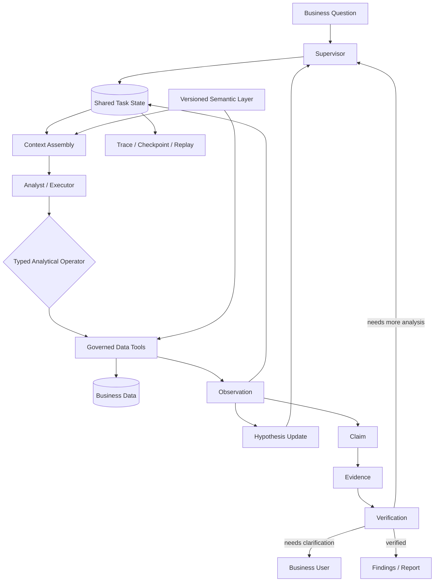

<div align="center">

# Enterprise Data Agent

### 企业自主数据分析智能体平台

**Autonomous multi-agent analytics for long-horizon business investigation.**

`Agent Systems` · `Multi-Agent Orchestration` · `Context Engineering` · `Semantic Layer` · `Agent Runtime`

</div>

Enterprise Data Agent is designed for multi-store business analysis where a useful answer requires more than generating one SQL query. It turns an ambiguous business question into a durable analysis task, then coordinates planning, data investigation, hypothesis updates, verification, and reporting over governed enterprise data.

Typical use cases include product, category, store, supplier, trend, anomaly, and contribution analysis.

```text
Business Question
      ↓
Resolve Business Semantics
      ↓
Plan Investigation
      ↓
Choose Analytical Action
      ↓
Execute Governed Data Tool
      ↓
Observation → Hypothesis Update
      ↓
Claim → Evidence → Verification
      ↓
Replan / Drill Down / Clarify / Finish
```

The core idea is simple:

> **The model decides what to analyze next; deterministic tools decide how the data is executed.**

---

## Why this is not another NL2SQL demo

| | Typical NL2SQL / ChatBI | Enterprise Data Agent |
| --- | --- | --- |
| Unit of work | One query | Durable analysis task |
| Reasoning | Generate SQL and summarize | Plan, observe, replan, verify |
| State | Prompt / chat history | Persistent task state |
| Business semantics | Schema hints in prompt | Versioned Semantic Layer |
| Data execution | Model-generated query logic | Bounded analytical operators + governed tools |
| Multi-agent coordination | Free-form conversation | Supervisor + structured handoff + shared state |
| Verification | Usually implicit | Claim → Evidence → Verification |
| Failure handling | Retry from the beginning | Trace, checkpoint, recovery, replay |

---

## Core design

### 1. Controlled multi-agent coordination

Long-running analysis becomes unstable when agents coordinate through unrestricted conversation: tasks are repeated, context drifts, and different agents may hold conflicting state.

Enterprise Data Agent uses a **Supervisor–Executor architecture**, **shared task state**, and **structured handoffs**.

- the **Supervisor** owns decomposition, routing, replanning, and stop decisions;
- specialized executors work inside bounded responsibilities;
- agents exchange structured observations through shared state instead of maintaining independent conversational memory;
- every meaningful step is traceable back to the task state.

```text
                    ┌───────────────┐
Business Question → │  Supervisor   │
                    └───────┬───────┘
                            ↓
                    ┌───────────────┐
                    │ Shared State  │
                    └───────┬───────┘
                            ↓
                 Specialized Executors
                            ↓
              Observation / Evidence / Status
                            ↓
                    Supervisor replans
```

### 2. Long-horizon runtime and context engineering

A long analysis task may accumulate plans, tool calls, query results, intermediate findings, failed attempts, and verification records. Replaying the entire trajectory into every model call increases cost and degrades context quality.

The runtime separates **durable task state** from **model context**:

- plans, actions, tool outputs, observations, claims, and validation results live outside the prompt;
- checkpoint and trace records preserve execution progress;
- context is assembled dynamically for the current role and subtask;
- retry, timeout, recovery, and replay are runtime concerns rather than prompt tricks.

This keeps the model context focused on the information required for the current decision while preserving the full task history externally.

### 3. Versioned Semantic Layer

Enterprise analytics is difficult because business meaning changes across regions, categories, and business units. The same term may map to different formulas, time rules, filters, joins, or availability windows.

Enterprise Data Agent separates business semantics from the Agent Core through a versioned **Semantic Layer**.

A semantic package can define:

- metrics and calculation rules;
- dimensions and allowed relationships;
- time semantics and data availability;
- business and quality rules;
- access policies and supported analytical capabilities.

The Agent Runtime therefore reasons against a stable semantic contract while business-specific definitions can evolve independently.

### 4. Typed analytical operators instead of unconstrained query generation

The agent is not asked to invent arbitrary SQL as its primary reasoning interface. Its action space is expressed through **typed analytical operators** such as:

- compare periods;
- inspect trends;
- break down by dimension;
- rank contributors;
- drill into anomalies;
- test a working hypothesis.

The agent selects the next analytical action from the current **Observation + Hypothesis + Task State**. A deterministic data layer executes the bounded operation and returns a structured result.

```text
Observation + Hypothesis
          ↓
Choose Next Analysis
          ↓
Typed Analytical Operator
          ↓
Deterministic Data Tool
          ↓
Structured Observation
          ↓
Update State / Replan / Finish
```

This moves the model's responsibility from **"write the query"** to **"decide the next useful analytical step."**

### 5. Evidence-backed verification

A correct query does not guarantee a correct business conclusion. An agent can still over-attribute a cause, ignore conflicting evidence, or turn an observation into a claim that the data does not support.

Enterprise Data Agent therefore treats claims and evidence as first-class objects.

```text
Observation
    ↓
Claim
    ↓
Evidence
    ↓
Verification
    ↓
Accept / Replan / Clarify / Reject
```

Important claims can be linked to the metric definition, query result, intermediate computation, dataset snapshot, semantic version, and validation result. Verification writes back into task state and can trigger additional investigation rather than allowing an unsupported conclusion into the final report.

---

## Architecture



---

## Example analysis loop

A question such as:

> **Why did Category A sales decline last month?**

is not treated as a single SQL request. A typical investigation may become:

1. resolve the metric, period, category, and comparison baseline;
2. compare current vs. prior period;
3. break the change down by store, product, or supplier;
4. rank the largest contributors;
5. inspect abnormal segments;
6. update or reject the working hypothesis;
7. verify the final claim against the underlying evidence;
8. produce findings with traceable support.

The exact path is determined by intermediate observations rather than fixed in advance.

---

## Public reference implementation

This repository is the publishable reference implementation of the architecture above. Proprietary business data, internal rules, and private integrations are replaced with reproducible public data and controlled fixtures.

The current public dataset uses **Iowa Class E wholesale order activity** and contains **6,484,227 curated fact rows** covering **2024-01-01 through 2026-07-31**. It is used to exercise the analytical contracts and runtime without exposing private business information.

The public implementation currently includes:

- versioned semantic packages;
- durable task and domain contracts;
- plans, hypotheses, observations, claims, evidence, and validation models;
- deterministic aggregate, trend, comparison, contribution, and PVM-style analysis paths;
- governed analytical execution;
- checkpoint artifacts, trace events, SSE task events, and replay surfaces;
- task history, investigation views, evidence inspection, and Markdown / HTML reports;
- reproducible data curation and validation commands.

The public codebase intentionally does **not** claim to reproduce every proprietary production integration. Full Supervisor–Executor orchestration, richer role-scoped context assembly, and complete multi-step resume are being rebuilt on top of the public contracts.

---

## Quick start

Requirements: **Python 3.12+**

```bash
make setup
make data
make dev
```

Open:

```text
http://127.0.0.1:8000
```

Optional PostgreSQL persistence:

```bash
docker compose up -d postgres
```

Run checks:

```bash
make test
make lint
make evaluation
```

---

## Public implementation stack

- **Python 3.12**
- **FastAPI / Pydantic**
- **SQLAlchemy / Alembic**
- **PostgreSQL** persistence contracts
- **OpenTelemetry** instrumentation
- **SQLGlot** SQL parsing / validation support
- **DuckDB + Parquet** only for the reproducible local analytical reference path

DuckDB is used here as an embedded public-data execution engine for reproducibility; it is not presented as the production data-warehouse architecture.

---

## Project structure

```text
src/eiw/domain/          Domain contracts and task-state models
src/eiw/semantic/        Versioned semantic packages
src/eiw/workspace/       Analysis workflow and data execution
src/eiw/persistence/     Durable relational persistence contracts
src/eiw/app.py           FastAPI application and task APIs
src/eiw/web/static/      Analysis workspace UI
semantic_packages/       Business semantics and rules
scripts/                 Ingestion, curation, validation
validation/              Independent data validation
evaluation/              Golden tasks and deterministic evaluation
data/fixtures/           Controlled failure-mode fixtures
docs/                    Architecture, ADRs, progress, gap analysis
```

---

## Design documentation

- [`Architecture Development Baseline`](docs/architecture-development-baseline.md)
- [`Core Module Design`](docs/core-module-design.md)
- [`Full Product Progress`](docs/FULL_PRODUCT_PROGRESS.md)
- [`Full Product Gap Analysis`](docs/FULL_PRODUCT_GAP_ANALYSIS.md)

---

## Design principle

> **Autonomous analysis should be stateful, semantically grounded, recoverable, and verifiable — not just fluent.**
