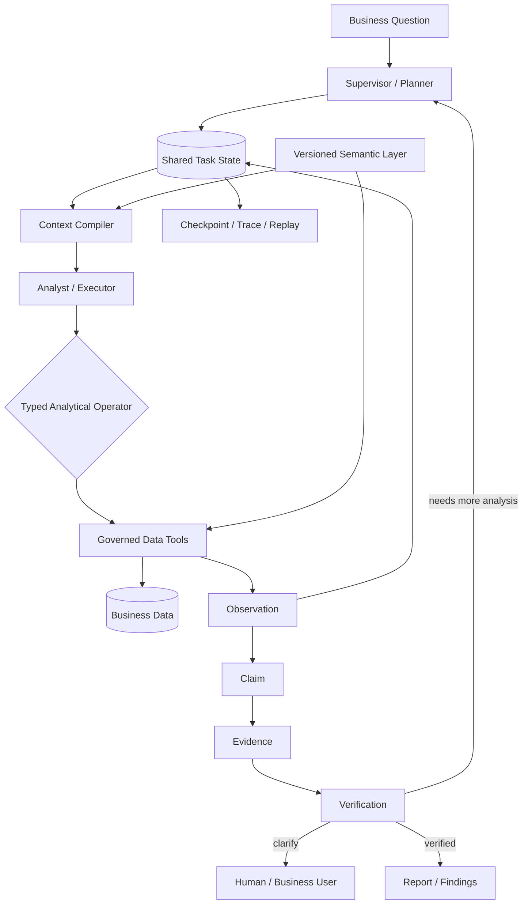

# Enterprise Data Agent

**Autonomous business analytics with controlled multi-agent orchestration, semantic grounding, durable task state, and evidence-backed verification.**

`Agent Systems` · `Multi-Agent Orchestration` · `Context Engineering` · `Semantic Layer` · `Agent Runtime`

Enterprise Data Agent is a public reconstruction of an enterprise autonomous analytics system for multi-store business operations. It is designed around a simple question:

> How can an AI system move beyond “write a query and summarize the result” and reliably complete a long-running business analysis task?

The target workflow is not one-shot NL2SQL. A business question is treated as a durable analysis task: the system resolves business semantics, plans the investigation, selects bounded analytical actions, executes governed data tools, records observations, updates hypotheses, verifies claims against evidence, and decides whether to drill down, replan, clarify, or finish.

The public repository intentionally replaces proprietary business data and rules with a reproducible public wholesale dataset and controlled fixtures. The current reference snapshot contains **6,484,227 curated fact rows**. The goal of the repository is to make the architecture, state model, semantic layer, analytical tool contracts, evidence model, and runtime design inspectable without exposing private business data.

---

## What this system is designed to solve

### 1. Multi-agent coordination without free-form agent chat

Long-running analysis becomes unstable when agents communicate through unrestricted conversation: work is repeated, context drifts, and different agents can hold inconsistent task state.

The architecture uses a **Supervisor–Executor model**, a **shared task state**, and **structured handoffs**. The Supervisor owns decomposition, routing, and replanning; specialized executors operate within bounded responsibilities and return structured observations to the shared state.

```text
Business Question
      ↓
Supervisor
      ↓
Shared Task State
      ↓
Specialized Executors
      ↓
Structured Observation / Evidence
      └──────────────→ Supervisor replans or terminates
```

The public implementation currently exposes the durable task/state contracts, plans, hypotheses, observations, execution records, trace events, and replay surfaces. Full Supervisor–Executor orchestration is being reconstructed on top of these contracts.

### 2. Long-horizon execution without losing state or exploding context

A useful analytics agent may need many model calls, SQL executions, tool results, intermediate findings, and verification steps. Passing the entire trajectory back into every model call is expensive and eventually degrades reasoning quality.

The runtime therefore separates **durable task state** from **model context**:

- plans, actions, tool outputs, observations, claims, and validation results are persisted outside the model context;
- checkpoint artifacts and trace events make task execution inspectable and replayable;
- context is assembled for the current role and subtask instead of replaying the full history;
- retry, timeout, and failure-recovery policies are treated as runtime concerns rather than prompt behavior.

The current reference runtime implements durable task/event storage, checkpoint artifacts, trace, and a replay endpoint. Full multi-step resume and richer role-scoped context assembly remain active reconstruction work.

### 3. Business semantics that are separate from the Agent Core

The hard part of enterprise analytics is rarely just SQL syntax. Different regions, categories, and business units can use different metric definitions, time semantics, filters, join policies, and business rules.

Enterprise Data Agent keeps these concerns in a versioned **Semantic Layer** rather than embedding them in prompts or agent code.

A semantic package can define:

- metrics and calculation rules;
- dimensions and allowed relationships;
- time semantics and availability windows;
- business rules and quality constraints;
- access policies and supported data objects.

This allows the same Agent Runtime to reason against a stable contract while business-specific definitions evolve independently.

### 4. Agents that decide *what to analyze*, not freely invent *how to query*

A common failure mode in data agents is to make the language model responsible for both analytical reasoning and low-level query construction. That couples business reasoning to schema details and makes errors difficult to control.

Enterprise Data Agent instead models analysis as a set of **typed analytical operators**, such as:

- compare periods;
- inspect trends;
- break down by dimension;
- rank contributors;
- investigate anomalies;
- test a working hypothesis.

The agent selects the next analytical action from the current **Observation + Hypothesis + Task State**. A deterministic data layer executes the bounded operation and returns structured results.

```text
Observation + Hypothesis
          ↓
   Select next analysis
          ↓
 Typed Analytical Operator
          ↓
 Deterministic Data Tool
          ↓
      Observation
          ↓
 Update Task State / Replan
```

This keeps the model focused on analytical decisions while the execution layer remains governed and reproducible.

### 5. Claims must be backed by evidence

A correct query does not guarantee a correct business conclusion. The system therefore separates **analysis output** from **verified claims**.

```text
Observation
    ↓
Claim
    ↓
Evidence
    ↓
Verification
    ↓
Accept / Replan / Clarify / Reject
```

Important claims can be linked to the metric definition, query result, intermediate computation, dataset snapshot, semantic version, context version, and validation result. Unsupported or inconsistent conclusions can be clarified, downgraded, or blocked before they become report output.

The reference implementation already contains the `Observation → Claim → Evidence` chain and core validation events; the broader verification rule set remains in progress.

---

## Architecture



### Architectural boundaries

| Layer | Responsibility |
| --- | --- |
| **Supervisor / Planner** | Task decomposition, routing, replanning, stop/clarification decisions |
| **Shared Task State** | Durable source of truth for plan, observations, hypotheses, claims, evidence, execution status |
| **Context Compiler** | Builds bounded, role-specific context from durable state |
| **Analytical Intelligence** | Chooses the next analytical action from task state and observations |
| **Semantic Layer** | Defines metrics, dimensions, time semantics, business rules, quality rules, access policy |
| **Governed Data Tools** | Executes bounded, reproducible data operations instead of unconstrained model-generated logic |
| **Evidence & Verification** | Links conclusions to data and validation results before report generation |
| **Runtime** | Checkpoint, trace, replay, retry/failure handling, budgets, timeout and execution control |

---

## Public reference implementation

The repository uses **Iowa Class E wholesale order activity** as a reproducible public reference domain. It is not consumer POS data and it is not presented as store profit or net profit.

Current implementation highlights:

- **6,484,227 curated fact rows** covering 2024-01-01 through 2026-07-31;
- versioned semantic package with metrics, dimensions, business rules, quality rules, and access policy;
- structured analysis intent, plans, hypotheses, observations, claims, evidence, and validation contracts;
- deterministic aggregate, trend, comparison, contribution, and PVM/mix-sensitive analysis paths;
- governed, allowlisted analytical execution;
- durable local task/event store plus PostgreSQL persistence contracts;
- checkpoint artifacts, trace events, SSE task events, and replay endpoint;
- evidence inspector, investigation workspace, task history, follow-up lineage, and Markdown/HTML report artifacts;
- reproducible data curation and independent validation commands.

### Reconstruction status

| Capability | Public reference status |
| --- | --- |
| Data foundation | **Implemented** |
| Versioned Semantic Layer | **Implemented** |
| Durable task/domain contracts | **Implemented** |
| Structured plans / hypotheses / observations | **Implemented** |
| Governed deterministic analysis tools | **Implemented / expanding** |
| Observation → Claim → Evidence | **Implemented** |
| Core validation events | **Implemented / expanding** |
| Task trace / checkpoint artifact / replay endpoint | **Implemented** |
| Full multi-step resume | **In progress** |
| Role-scoped dynamic context assembly | **In progress** |
| Full Supervisor–Executor orchestration | **In progress** |
| Broader verification and evaluation suite | **In progress** |

The distinction is intentional: this repository documents and reconstructs the production design patterns without claiming that every private-system capability has already been reproduced in the public codebase.

---

## Data and trust model

The frozen public snapshot is `iowa_liquor_snapshot_2026_07_v1`.

- coverage: **2024-01-01 → 2026-07-31**;
- curated fact rows: **6,484,227**;
- raw data is retained for audit;
- exact duplicates are handled by an explicit curation policy;
- cost/spread metrics are only treated as valid from **2025-07-01** onward;
- unsupported profit questions are clarified instead of silently approximated.

Important findings can be linked back to observations, computations, result hashes, dataset snapshot, semantic version, context version, and validation labels.

---

## Quick start

Requirements: **Python 3.12+**.

```bash
make setup
make data
make dev
```

Open:

```text
http://127.0.0.1:8000
```

The default local provider is deterministic and credential-free so that the public reference path is reproducible.

Optional PostgreSQL persistence:

```bash
docker compose up -d postgres
```

---

## Tests and evaluation

```bash
make test
make lint
make evaluation
```

The repository includes deterministic Golden Cases for the public reference workflow. Evaluation results are persisted only after a reproducible run; scores are not fabricated when a metric has not been measured.

Evaluation is organized around dimensions such as:

- semantic correctness;
- numeric correctness;
- evidence coverage;
- correct abstention / clarification;
- policy compliance;
- runtime success;
- report faithfulness.

---

## Project structure

```text
src/eiw/domain/              Domain contracts and state models
src/eiw/semantic/            Semantic package loading and contracts
src/eiw/workspace/           Analysis workflow, data access, task persistence
src/eiw/persistence/         Durable relational persistence contracts
src/eiw/app.py               FastAPI application and public task APIs
src/eiw/web/static/          Analysis workspace UI
semantic_packages/           Versioned business semantics
scripts/                     Data ingestion, curation, validation
validation/                  Independent data validation
 evaluation/                 Golden tasks and deterministic evaluation
 data/fixtures/              Controlled failure-mode fixtures
 docs/                       Architecture, ADRs, progress and gap analysis
```

---

## Design principles

1. **Task, not query.** A business question becomes a durable analysis task rather than a single text-to-SQL request.
2. **State outside the prompt.** Durable task state is the source of truth; model context is assembled from it.
3. **Controlled multi-agent collaboration.** Agents coordinate through explicit state and handoffs, not unrestricted conversation.
4. **Semantics before SQL.** Metrics and business rules are resolved before execution.
5. **Model decides what; deterministic tools decide how.** Analytical reasoning and governed execution remain separate.
6. **Claims require evidence.** Important conclusions must be traceable to data and validation results.
7. **Failure is part of the runtime.** Retry, timeout, checkpoint, resume, clarification, and failure classification are system concerns.
8. **Measured, not invented.** Public evaluation and performance values are reported only when reproducibly measured.

---

## Design documentation

For the deeper architecture and implementation history, see:

- [`docs/architecture-development-baseline.md`](docs/architecture-development-baseline.md)
- [`docs/core-module-design.md`](docs/core-module-design.md)
- [`docs/FULL_PRODUCT_PROGRESS.md`](docs/FULL_PRODUCT_PROGRESS.md)
- [`docs/FULL_PRODUCT_GAP_ANALYSIS.md`](docs/FULL_PRODUCT_GAP_ANALYSIS.md)

---

## Why this project exists

Most data-agent demos optimize for the shortest path from natural language to SQL. Enterprise analysis has a different failure surface: inconsistent business definitions, long-running task state, ambiguous evidence, tool failures, repeated reasoning, and conclusions that may not be justified by the underlying data.

Enterprise Data Agent focuses on that harder layer: **how to make autonomous analysis controlled, stateful, semantically grounded, recoverable, and verifiable.**
