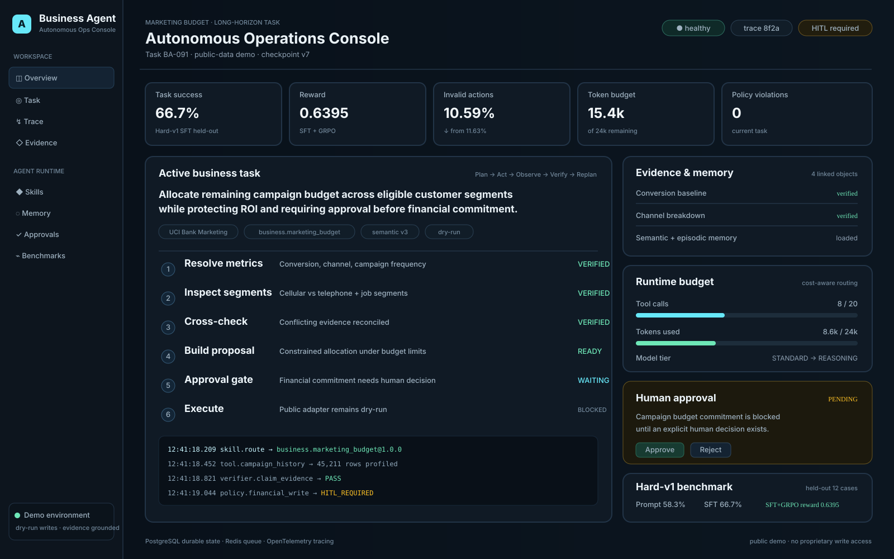
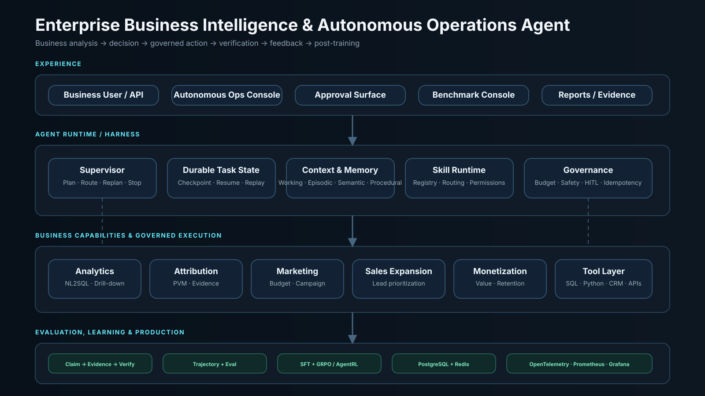

# Demo Console

The repository includes a presentation-focused demo surface for the complete
Business Intelligence & Autonomous Operations Agent.

## Run

```bash
make setup
make dev
```

Open:

```text
http://127.0.0.1:8000/demo
```

The demo uses deterministic presentation data so it can show the full product
surface even when the large Iowa snapshot, PostgreSQL, Redis, or proprietary
external systems are not connected.

It demonstrates:

- a long-horizon marketing-budget task;
- Plan → Act → Observe → Verify → Replan execution;
- Skill routing;
- evidence and layered memory;
- token/tool budgets and model routing;
- a Human-in-the-loop financial approval gate;
- trace events;
- Hard-v1 benchmark results;
- public dry-run boundaries.

The demo is a **product presentation surface**, not a fabricated live production
run. Actual analytical APIs, benchmark pipelines, PostgreSQL/Redis integrations,
and CI verification remain separate and are described in the main README.

## Preview



## Architecture


