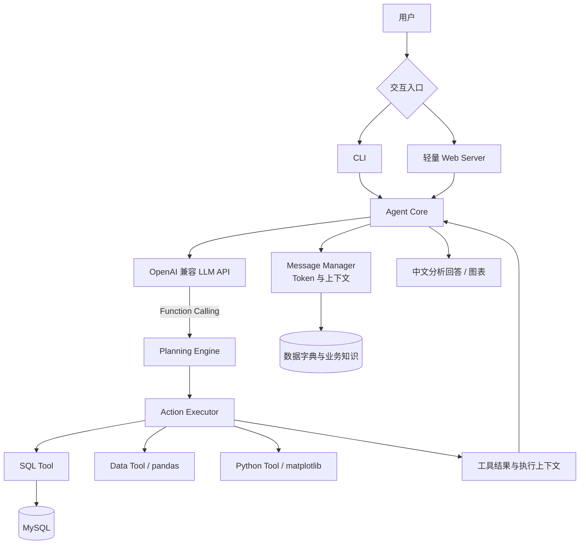

# iQuery Agentic ChatBI Platform

一个面向企业业务数据的 Agentic ChatBI 原型：用户用自然语言提问，Agent 根据上下文选择 SQL、数据提取和 Python 分析工具，完成查询、计算、可视化与中文解释。

> 项目定位：课程项目整理后的可运行原型 / P0 验证版本。它的重点是“业务问题驱动的数据分析 Agent”，不是通用聊天机器人，也不是 Text-to-Cycle 项目。

## 项目定位

企业分析工作的难点通常不在单条 SQL，而在于把一个模糊问题拆成多个可执行步骤：理解业务口径、查询数据、整理 DataFrame、计算指标、生成图表，再把结果解释成业务人员能使用的结论。

iQuery 将这条链路收敛为一个最小闭环：

```text
自然语言问题
    ↓
OpenAI 兼容模型 + Function Calling
    ↓
Agent 多轮决策（ReAct Loop）
    ↓
SQL 查询 / DataFrame 提取 / Python 分析
    ↓
结果、图表与中文业务解释
```

### 它和其他项目的区别

| 项目类型 | 核心关注点 | iQuery 的区别 |
| --- | --- | --- |
| 通用数据分析项目 | 数据清洗、统计、可视化脚本 | iQuery 增加了自然语言入口和工具调用决策 |
| Text-to-Cycle 类项目 | 文本到某种固定流程或结构化产物 | iQuery 面向企业数据问答与分析闭环，输出可验证的数据结果和业务解释 |
| 通用 Chatbot | 对话生成 | iQuery 的回答需要通过 SQL / Python 工具获取数据依据 |
| 大型数据平台 | 调度、数仓、权限、治理、服务化 | iQuery 是围绕 Agent 分析体验的轻量 P0 原型，尚未宣称为生产级平台 |

## 项目背景

本项目来自企业数据分析平台课程实践，原始目录混合了源码、课件、规划文档、历史问答、实验产物和开发工具目录。整理后的仓库只保留一条清晰主线：

1. 用电信用户流失数据作为示例业务域。
2. 用数据字典和业务知识为 Agent 提供上下文。
3. 通过 OpenAI 兼容 API 让模型决定是否调用分析工具。
4. 通过 MySQL、pandas、Python 和 matplotlib 完成数据处理。
5. 通过 CLI 和轻量 Web 页面提供交互入口。

当前示例数据来自 Telco Customer Churn 场景，围绕用户画像、服务订阅、支付情况和用户流失四类信息组织。数据字典位于 [`data/knowledge/iquery数据字典.md`](data/knowledge/iquery数据字典.md)。

## 产品价值与目标用户

### 目标用户

- 需要快速探索业务数据的产品经理、运营人员和业务分析师。
- 想验证“自然语言问数 + 工具执行”闭环的数据产品团队。
- 学习 Agent、Function Calling、ChatBI 和企业数据分析系统的工程师。

### 典型问题

```text
哪些类型的用户更容易流失？
不同合同类型的用户流失率有什么差异？
月费用和流失之间是否存在明显关系？
请把这个结论用图表展示出来。
```

### 直接价值

- 降低业务人员进入数据库和编写分析代码的门槛。
- 让一次分析从“问问题”开始，而不是从“找表、写 SQL”开始。
- 把查询、计算、绘图和解释串成连续对话。
- 保留工具结果和执行上下文，便于多轮追问。

## 产品结构

```text
交互层
├── CLI：python -m src
└── Web：python -m src web

Agent 编排层
├── Agent Core：模型调用与 ReAct 循环
├── Planning Engine：解析工具调用与执行计划
├── Action Executor：统一执行、错误恢复、结果记录
└── Message Manager：历史消息与 Token 控制

分析能力层
├── SQL Tool：查询 MySQL
├── Data Tool：把查询结果提取为 DataFrame
└── Python Tool：执行 Python 分析并跟踪图表

知识与数据层
├── 数据字典
├── 业务知识
├── 原始 CSV
├── 处理后 CSV
└── MySQL 业务表
```

## 核心亮点

### 1. 以工具调用为中心的 Agent

模型不是直接“猜一个答案”，而是通过结构化工具调用选择：

- `sql_inter`：执行 SQL 查询。
- `extract_data`：获取适合进一步计算的数据。
- `python_inter`：执行 pandas / matplotlib 分析代码。

所有工具由 [`src/tools/registry.py`](src/tools/registry.py) 统一注册，后续增加工具只需要扩展注册和实现，不必重写 Agent 主循环。

### 2. ReAct 风格的多步分析

一次用户提问可以经过多轮模型决策：先查询数据，再提取 DataFrame，再计算指标或生成图表，最后形成自然语言答复。循环次数由 `max_iterations` 控制，默认最多 10 轮，用于避免异常情况下无限执行。

### 3. 面向中文业务分析的知识上下文

启动时会加载数据字典和业务介绍，作为系统上下文注入消息管理器。Agent 因此不仅知道字段名，也能理解字段的业务含义和示例数据范围。

### 4. Token 与对话上下文管理

`MessageManager` 使用 `tiktoken` 统计上下文长度，并在达到阈值时裁剪历史消息，避免多轮对话无限膨胀。当前默认阈值为 3000 Token，可在配置中调整。

### 5. 错误恢复与分析产物跟踪

工具执行失败时，执行器会记录错误并进行有限重试；执行过程中产生的 DataFrame 和 matplotlib 图表也会被记录，便于返回上下文状态和后续扩展产物管理。

### 6. 低依赖、易运行

Web 入口使用 Python 标准库 `http.server`，不额外引入 Web 框架；核心分析能力集中在少量模块中，适合学习、演示和 P0 验证。

## 技术架构

### 运行时架构



源码证据驱动的架构图也保存在 [`docs/architecture/current-runtime.html`](docs/architecture/current-runtime.html)，JSON 源文件在 [`docs/architecture/current-runtime.architecture.json`](docs/architecture/current-runtime.architecture.json)。

### 一次请求的执行流程

1. CLI 或 Web 接收用户输入。
2. `Agent.chat()` 把用户消息加入上下文。
3. Agent 调用 OpenAI 兼容模型，并把已注册工具作为 `tools` 传入。
4. 如果模型返回工具调用，`PlanningEngine` 解析函数名和参数。
5. `ActionExecutor` 找到对应函数并执行，失败时进行有限重试。
6. 工具结果以 `tool` 消息写回上下文。
7. Agent 继续下一轮模型调用，直到模型返回最终文字或达到最大迭代次数。
8. CLI / Web 返回中文答案，并保留当前会话中的上下文状态。

## 技术选型

| 技术 | 当前用途 | 选择原因 | 当前边界 |
| --- | --- | --- | --- |
| Python | Agent 编排、数据处理、Web 入口 | AI SDK 和数据分析生态成熟，代码短，适合快速验证闭环 | 生产化时需要补充并发、进程隔离和服务治理 |
| OpenAI 兼容 API | 调用推理模型和 Function Calling | 兼容不同供应商和自建网关，降低模型切换成本 | 当前默认地址来自项目配置，具体模型能力取决于服务端 |
| Function Calling | 让模型选择工具并生成参数 | 比纯文本解析更结构化，工具边界更清晰 | 仍需补充参数校验、SQL 安全策略和调用审计 |
| ReAct Loop | 支持多步查询与分析 | 适合“查询 → 计算 → 解释”的连续任务 | 当前是同步循环，复杂任务缺少异步任务队列 |
| MySQL | 企业业务数据查询 | 关系型数据、SQL 和指标分析天然匹配 | 当前连接配置和示例表结构偏固定，缺少权限隔离 |
| pandas | DataFrame 分析 | 适合表格数据清洗、聚合和探索性分析 | 大数据场景不能把全量数据直接拉入单机内存 |
| matplotlib | 生成分析图表 | 依赖成熟、适合快速验证可视化能力 | 图表尚未形成独立的持久化资产服务 |
| tiktoken | Token 计数和上下文裁剪 | 可在发送请求前控制上下文规模 | 不同模型的 tokenizer 可能存在差异 |
| Python 标准库 HTTP Server | 提供演示 Web 入口 | 零框架依赖，启动路径简单 | 不适合直接承担生产流量、鉴权和多租户 |
| pytest | 自动化测试 | 轻量、易接入，适合当前小型 P0 | 当前测试覆盖核心单元路径，集成覆盖仍需加强 |

### 关键技术选择的取舍

#### 为什么采用 OpenAI 兼容接口

项目把模型客户端固定在 OpenAI SDK 的兼容协议上，模型名、API 地址和密钥可以通过配置切换。这样能保留统一的消息和工具调用协议，同时避免把业务代码绑定到某一个模型供应商。

#### 为什么使用 Function Calling，而不是关键词路由

关键词路由适合非常固定的意图集合，但企业分析问题通常需要判断查询、聚合、计算和绘图的组合。Function Calling 能让模型先理解问题，再生成结构化工具调用；项目中的规划引擎仍保留少量关键词建议逻辑，作为辅助而不是唯一路由机制。

#### 为什么选择 MySQL + pandas

MySQL 负责业务数据的持久化和 SQL 聚合，pandas 负责小规模结果的二次处理，两者职责清晰。当前项目是可运行原型，不引入 ORM、数据湖或分布式计算框架，避免在尚未验证用户价值时增加基础设施复杂度。

#### 为什么 Web 入口暂时使用标准库

当前目标是验证 Agent 分析闭环，Web 页面只需要提供输入、会话和结果展示。标准库服务可以减少依赖和启动成本；当需要并发、鉴权、流式输出、OpenAPI 或部署治理时，再升级到 FastAPI 等成熟服务框架更合适。

#### 为什么需要上下文裁剪

多轮分析会累积用户问题、模型工具调用和工具结果。无限保留历史会增加成本并触发上下文限制，因此使用 Token 阈值做主动裁剪。未来应升级为按会话摘要、关键事实保留和工具结果压缩的策略。

## 仓库结构

```text
.
├── src/
│   ├── agent/              # Agent 核心、规划和执行
│   ├── config/             # 数据库、模型、Agent、Web 配置
│   ├── memory/             # 消息历史和 Token 管理
│   ├── tools/              # SQL、DataFrame、Python 工具及注册器
│   ├── web/                # 轻量 Web 服务
│   ├── cli.py              # CLI 交互
│   ├── main.py             # 命令分发
│   └── __main__.py         # python -m src 入口
├── data/
│   ├── raw/                # 原始 CSV
│   ├── processed/          # 处理后的示例数据
│   ├── knowledge/          # 数据字典与业务知识
│   └── prepare_data.ipynb  # 数据准备 notebook
├── docs/
│   ├── architecture/       # 当前运行时架构图
│   └── ...                  # 课件、历史问答与问题记录
├── tests/                  # 自动化测试
├── .gitignore
├── requirements.txt
└── README.md
```

### 目录分类原则

- `src/` 只放可运行源码，不再使用模糊的“代码”目录。
- `data/` 只放运行所需的数据、数据准备脚本和知识库。
- `docs/` 集中放课件、历史文档、问题记录和架构说明。
- `tests/` 只放验证代码。
- 运行缓存、虚拟环境、日志和本地密钥由 `.gitignore` 排除。

## 快速开始

### 1. 准备 Python 环境

项目已在 Windows + Python 3.12 环境下验证。建议使用项目独立虚拟环境：

```powershell
cd "D:\01_project\王牌项目-从idea到产品\企业数据分析平台\Agent大型项目实战1：百亿级智能数据分析平台"
python -m venv .venv
.\.venv\Scripts\Activate.ps1
python -m pip install -r requirements.txt
```

### 2. 配置模型 API

最少需要设置 `OPENAI_API_KEY`：

```powershell
$env:OPENAI_API_KEY = "你的 API Key"
```

当前默认模型和 API 地址在 [`src/config/settings.py`](src/config/settings.py) 中定义：

```text
模型：gpt-3.5-turbo
地址：https://newone.nxykj.tech/v1
```

如果使用其他 OpenAI 兼容服务，需要同步调整 `APIConfig` 中的 `base_url` 和 `model`。不要把真实密钥写入源码、README 或 Git 历史。

### 3. 准备 MySQL（需要真实数据分析时）

SQL 和数据提取工具默认连接：

```text
host=localhost
user=iquery_agent
database=iquery
charset=utf8
```

示例业务表为：

- `user_demographics`：用户基本画像。
- `user_services`：电话和互联网服务订阅。
- `user_payments`：合同、支付方式和费用。
- `user_churn`：用户是否流失。

连接信息和表结构应根据实际环境修改。当前代码保留了课程示例默认值，正式环境必须改为安全的环境变量、密钥管理服务或部署配置，不能继续使用示例凭据。

### 4. 运行

命令行：

```powershell
python -m src
```

Web 页面：

```powershell
python -m src web
```

打开 <http://127.0.0.1:9999>。

CLI 内置命令：

```text
exit / quit / 退出    退出程序
status                查看当前上下文、DataFrame 和图表数量
clear                 清空当前 Agent 会话
```

### 5. 运行测试

```powershell
python -m pytest -q
```

当前测试覆盖 Agent 基础执行路径、规划逻辑和工具注册等核心单元行为。涉及真实模型、MySQL 和浏览器交互的验证需要在对应依赖可用时进行。

## 配置项说明

配置集中在 [`src/config/settings.py`](src/config/settings.py)：

| 配置组 | 关键项 | 默认值 | 作用 |
| --- | --- | --- | --- |
| API | `api_key` | `OPENAI_API_KEY` | 模型访问密钥 |
| API | `base_url` | `https://newone.nxykj.tech/v1` | OpenAI 兼容服务地址 |
| API | `model` | `gpt-3.5-turbo` | 模型名称 |
| API | `max_tokens` | `2000` | 单次输出上限配置 |
| API | `temperature` | `0.7` | 输出随机性配置 |
| Agent | `tokens_threshold` | `3000` | 上下文裁剪阈值 |
| Agent | `max_iterations` | `10` | 单次请求最大工具循环次数 |
| Database | `host` | `localhost` | MySQL 地址 |
| Database | `database` | `iquery` | 数据库名称 |
| Web | `host` | `127.0.0.1` | 本地服务监听地址 |
| Web | `port` | `9999` | 本地服务端口 |

## 当前能力边界

这是一个可运行的 Agentic ChatBI 原型，不是已经完成生产治理的百亿级数据平台。当前需要明确的边界包括：

- Python 工具允许执行动态分析代码，只适合受信任的本地或隔离环境。
- SQL 工具当前缺少完整的只读校验、参数化查询、超时和数据权限控制。
- 数据库默认配置仍偏向课程演示，尚未完成多环境配置和密钥托管。
- Web 会话保存在进程内存，服务重启后不会保留完整会话。
- Web 和 CLI 的部分工具调用路径仍存在重复实现，后续应统一到同一个 Agent 服务层。
- 当前没有登录、组织隔离、租户隔离、操作审计和敏感字段脱敏。
- 当前没有流式输出、异步任务队列、分布式计算和大结果集分页策略。
- 当前测试没有覆盖真实 LLM、真实 MySQL 和生产部署环境。
- 课程课件和历史文档已集中到 `docs/`，公开发布前仍需确认其版权和数据分发许可。

## 升级路线

### P0：先把分析闭环做安全、稳定

1. 增加 SQL 只读白名单、危险语句拦截、参数校验、查询超时和结果行数上限。
2. 让 Web 和 CLI 完全复用同一套 Agent / Tool 服务层，删除重复执行逻辑。
3. 将数据库、模型和 Web 配置改为环境变量或部署配置，并提供 `.env.example`。
4. 增加真实 MySQL 与 OpenAI 兼容 API 的可控集成测试，记录请求、工具调用和结果证据。
5. 统一错误协议，让模型能够区分参数错误、权限错误、连接错误和业务无数据。

### P1：从本地原型升级为可用产品

1. 使用 FastAPI 或同类框架提供 API、流式输出、健康检查和 OpenAPI 文档。
2. 引入持久化会话、用户身份、组织 / 租户隔离和权限模型。
3. 增加数据源注册、表结构缓存、指标口径管理和数据权限映射。
4. 为 SQL、Python 和图表产物增加审计记录、下载和复用能力。
5. 增加端到端回归集：问题、预期工具链、SQL 结果、业务解释和安全约束。

### P2：走向企业级智能分析平台

1. 建立语义层，把指标定义、维度、时间口径和权限从提示词中抽离出来。
2. 引入 RAG / 向量检索，检索业务制度、指标说明、历史分析和数据资产元数据。
3. 对超大数据量采用查询下推、预聚合、缓存或 Spark / DuckDB 等合适的计算引擎。
4. 增加模型路由、成本预算、延迟监控、工具成功率和答案可信度评估。
5. 引入数据脱敏、沙箱执行、审批流和可追溯证据链，满足企业安全与合规要求。

## 质量与验证

本整理版已验证以下路径：

```powershell
python -m pytest -q
python -m src web
```

Web smoke check：访问 `http://127.0.0.1:9999/` 能返回首页并显示 iQuery。完整 Agent 对话还需要可用的模型 API Key 和 MySQL 数据库，因此不会把“页面能打开”误写成“生产链路已验证”。

## 开发约定

- 源码入口固定在 `src/`，不要重新创建模糊的课程式“代码”目录。
- 新增分析能力优先实现为工具，再通过 `ToolRegistry` 注册。
- 文档、课件、历史资料统一放在 `docs/`；运行所需知识放在 `data/knowledge/`。
- 任何外部 API、数据库和动态代码执行都必须明确错误边界与安全边界。
- 修改后至少运行相关 pytest；改变 Web 或启动入口时，增加一次本地 HTTP smoke check。

## License 与资料说明

当前仓库没有新增许可证声明。项目中的课程课件、历史文档和示例数据的版权 / 分发许可需要由项目维护者确认；在公开仓库发布前，请先清理不具备公开授权的材料，或将仓库保持为私有。

## 项目名称

推荐仓库名：`iquery-agentic-chatbi-platform`

这个名称明确表达了三件事：iQuery 项目品牌、Agentic 分析方式、ChatBI 产品定位，同时避开泛化的 `data-analysis` 和 `text-to-cycle` 命名，方便在 GitHub 上与其他项目区分。
